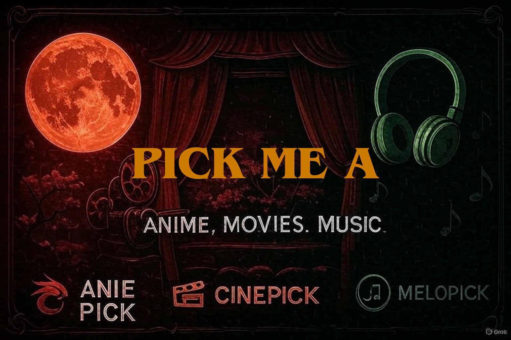

# Pick Me A - Entertainment Discovery Hub 🎬🎵🎌


<div align="center">

[](https://pickmea.netlify.app/) [](https://peerlist.io/personal_dev/project/pick-me-a)
[](https://www.producthunt.com/products/pick-me-a)

</div>


---

<div align="center">

[](https://reactjs.org/)
[](https://www.typescriptlang.org/)
[](https://vitejs.dev/)
[](https://tailwindcss.com/)
[](https://opensource.org/licenses/MIT)

</div>

</div>

> **An immersive cinematic hub for discovering your next favorite anime, movies, and music**

## ✨ Features

- 🎌 **AniePick** - Discover amazing anime series and movies
- 🎬 **CinePick** - Find your next favorite films and cinema
- 🎵 **MeloPick** - Explore new music and artists
- 🌌 **Immersive 3D Portal Experience** - Interactive portal cards with stunning visual effects
- 📱 **Responsive Design** - Beautiful experience across all devices
- 🎨 **Dynamic Themes** - Unique visual themes for each entertainment category

## 🎯 Connected Platforms

### 🎌 AniePick - Anime Discovery
[](https://aniepick.netlify.app)
[](https://github.com/itzdineshx/Anie_Pick)


- **Theme**: Japanese-inspired with cherry blossom particles
- **Color**: Deep Red (#dc2626)
- **Features**: Personalized anime recommendations
- **Database**: 10,000+ anime titles

### 🎬 CinePick - Movie Discovery  
[](https://cinempick.netlify.app)
[](https://github.com/itzdineshx/Cine_Pick)


- **Theme**: Hollywood glamour with film strip elements
- **Color**: Golden Yellow (#fbbf24)  
- **Features**: Smart movie matching algorithm
- **Integration**: Powered by The Movie Database

### 🎵 MeloPick - Music Discovery
[](https://melopick.netlify.app)
[](https://github.com/itzdineshx/Melo_Pick)


- **Theme**: Audio-visual with soundwave animations
- **Color**: Neon Green (#10b981)
- **Features**: AI-powered music recommendations
- **Integration**: Spotify API for seamless discovery
  
## 🛠️ Built With

- **Frontend Framework**: React 18 with TypeScript
- **Build Tool**: Vite
- **Styling**: Tailwind CSS with custom design system
- **3D Graphics**: React Three Fiber & Three.js
- **UI Components**: Radix UI with shadcn/ui
- **Routing**: React Router DOM
- **State Management**: TanStack Query
- **Icons**: Lucide React

## 🏁 Quick Start

### Prerequisites

- Node.js 18+ or Bun
- npm, yarn, or bun package manager

### Installation

```bash
# Clone the repository
git clone https://github.com/your-username/pick-me-a.git

# Navigate to project directory
cd pick-me-a

# Install dependencies
npm install
# or
bun install

# Start development server
npm run dev
# or
bun dev
```

The application will be available at `http://localhost:8080`

## 📁 Project Structure

```
├── .gitignore
├── LICENSE
├── README.md
├── bun.lockb
├── components.json
├── eslint.config.js
├── index.html
├── package-lock.json
├── package.json
├── postcss.config.js
├── public
    ├── placeholder.svg
    └── surprise-box.png
├── src
    ├── App.css
    ├── App.tsx
    ├── assets
    │   ├── anime-eye-icon.png
    │   ├── cine-pick-logo.png
    │   ├── cinematic-entertainment-background.jpg
    │   ├── cinepick-logo2.png
    │   ├── enhanced-panoramic-entertainment-universe.jpg
    │   ├── equalizer-icon.png
    │   ├── film-reel-icon.png
    │   ├── melopick-logo.png
    │   ├── melopick-logo2.png
    │   ├── panoramic-entertainment-background.jpg
    │   ├── panoramic-entertainment-universe.jpg
    │   ├── pick.jpg
    │   ├── pick2.png
    │   ├── pick3.png
    │   ├── sugoi-pick-logo.png
    │   └── sugoipick-logo1.png
    ├── components
    │   ├── AdvancedCursorEffects.tsx
    │   ├── CinematicTitle.tsx
    │   ├── Enhanced3DPortalCard.tsx
    │   ├── EnhancedPortalCard.tsx
    │   ├── EnhancedPortalTransition.tsx
    │   ├── Portal3D.tsx
    │   ├── PortalCard.tsx
    │   ├── PortalCardEffects.tsx
    │   ├── PortalCardIcon.tsx
    │   ├── PortalTransition.tsx
    │   ├── SimpleBackground.tsx
    │   ├── SimpleCursorEffects.tsx
    │   ├── UniverseBackground.tsx
    │   └── ui
    │   │   ├── accordion.tsx
    │   │   ├── alert-dialog.tsx
    │   │   ├── alert.tsx
    │   │   ├── aspect-ratio.tsx
    │   │   ├── avatar.tsx
    │   │   ├── badge.tsx
    │   │   ├── breadcrumb.tsx
    │   │   ├── button.tsx
    │   │   ├── calendar.tsx
    │   │   ├── card.tsx
    │   │   ├── carousel.tsx
    │   │   ├── chart.tsx
    │   │   ├── checkbox.tsx
    │   │   ├── collapsible.tsx
    │   │   ├── command.tsx
    │   │   ├── context-menu.tsx
    │   │   ├── dialog.tsx
    │   │   ├── drawer.tsx
    │   │   ├── dropdown-menu.tsx
    │   │   ├── form.tsx
    │   │   ├── hover-card.tsx
    │   │   ├── input-otp.tsx
    │   │   ├── input.tsx
    │   │   ├── label.tsx
    │   │   ├── menubar.tsx
    │   │   ├── navigation-menu.tsx
    │   │   ├── pagination.tsx
    │   │   ├── popover.tsx
    │   │   ├── progress.tsx
    │   │   ├── radio-group.tsx
    │   │   ├── resizable.tsx
    │   │   ├── scroll-area.tsx
    │   │   ├── select.tsx
    │   │   ├── separator.tsx
    │   │   ├── sheet.tsx
    │   │   ├── sidebar.tsx
    │   │   ├── skeleton.tsx
    │   │   ├── slider.tsx
    │   │   ├── sonner.tsx
    │   │   ├── switch.tsx
    │   │   ├── table.tsx
    │   │   ├── tabs.tsx
    │   │   ├── textarea.tsx
    │   │   ├── toast.tsx
    │   │   ├── toaster.tsx
    │   │   ├── toggle-group.tsx
    │   │   ├── toggle.tsx
    │   │   ├── tooltip.tsx
    │   │   └── use-toast.ts
    ├── hooks
    │   ├── use-mobile.tsx
    │   └── use-toast.ts
    ├── index.css
    ├── lib
    │   └── utils.ts
    ├── main.tsx
    ├── pages
    │   ├── Index.tsx
    │   └── NotFound.tsx
    └── vite-env.d.ts
├── tailwind.config.ts
├── tsconfig.app.json
├── tsconfig.json
├── tsconfig.node.json
└── vite.config.ts
```

## 🎨 Design System

The project uses a comprehensive design system with:
- Custom HSL color tokens for theming
- Semantic color variables for consistency
- Responsive typography scale
- Component variants for different states
- Dark/light mode support

## 🚀 Deployment

### Netlify (Recommended)

1. Fork this repository
2. Connect your GitHub account to Netlify
3. Create a new site from your forked repository
4. Update the Netlify badge URL in this README
5. Deploy settings:
   - Build command: `npm run build`
   - Publish directory: `dist`

### Other Platforms

The app can be deployed to any static hosting service:
- Vercel
- GitHub Pages
- Firebase Hosting
- AWS S3 + CloudFront

## 📱 Browser Support

- ✅ Chrome (latest)
- ✅ Firefox (latest)
- ✅ Safari (latest)
- ✅ Edge (latest)

## 🤝 Contributing

Contributions are welcome! Please feel free to submit a Pull Request.

1. Fork the project
2. Create your feature branch (`git checkout -b feature/AmazingFeature`)
3. Commit your changes (`git commit -m 'Add some AmazingFeature'`)
4. Push to the branch (`git push origin feature/AmazingFeature`)
5. Open a Pull Request

## 📄 License

This project is licensed under the MIT License - see the [LICENSE](LICENSE) file for details.

## 👨‍💻 Author

**DINESH S**

[](https://github.com/itzdineshx)
[](https://www.linkedin.com/in/dineshs2/)

## 🙏 Acknowledgments

- Built with [Lovable](https://lovable.dev) - AI-powered web development
- Icons by [Lucide](https://lucide.dev)
- 3D graphics powered by [Three.js](https://threejs.org)
- UI components from [shadcn/ui](https://ui.shadcn.com)

---

<div align="center">
  Made with ❤️ and AI assistance
</div>
